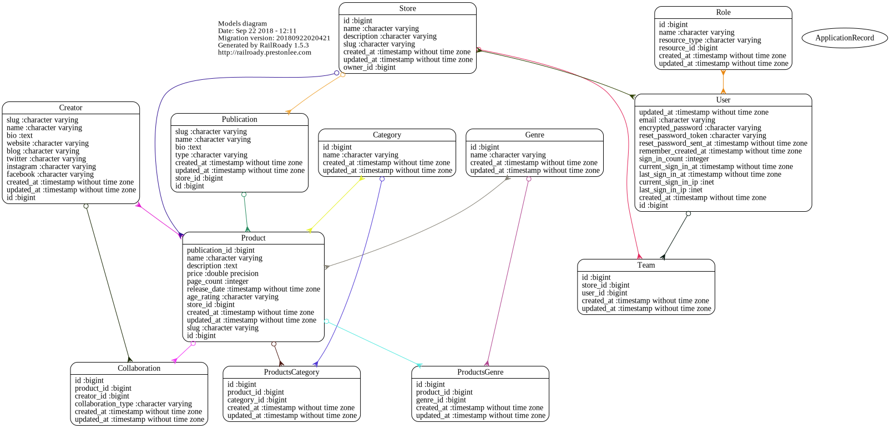

## [Comix](https://comix.life) - A marketplace for independent comics

[ ](https://app.codeship.com/projects/255140)
[](https://codeclimate.com/github/safewlabs/comix-mono/maintainability)
[](https://codecov.io/gh/safewlabs/comix-mono) 

### Stack

* Ruby 2.6.1
* Rails 6
* PostgreSQL
* Stimulus JS
* Tailwind CSS
* RSpec, Capybara, FactoryBot, Faker
* Sidekiq & Redis

### Services

* Codeship CI
* CodeClimate Code quality metrics
* Codecov for code coverage metrics
* Heroku for Hosting

### Install instructions

Install all the pre-requisites and clone the repo. cd into the app directory.

```shell
$ bundle install
$ yarn install
$ rails db:create db:migrate db:seed
```
In order to run the server, install foreman

```
$ gem install foreman
```
Start the server.

```shell
$ foreman start -f Procfile.dev
```
Or use docker

```
$ docker-compose up
```

### Testing

We use RSpec as our testing framework. Run the tests using the following command :

```
bundle exec rspec
```

### Models

